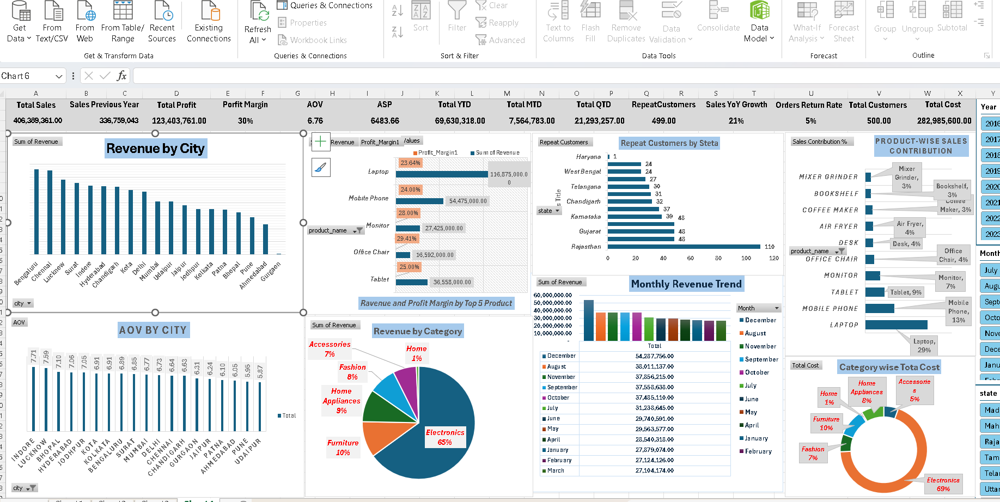

# E-Commerce Sales & Profitability Dashboard
## Dashboard Preview



## 1. Project Overview

This project analyzes e-commerce sales, profitability, customers, products, categories, cities, and time-based performance using **Excel Power Pivot, DAX, PivotTables, and interactive charts**.

The objective is not only to report sales numbers, but to convert raw transactional data into **business insights that can support management decision-making**.

### Key Business Questions

* How much revenue is the business generating?
* Is revenue growing compared with the previous year?
* Which cities generate the highest revenue?
* Which categories contribute the most sales?
* Which products drive revenue?
* Which products have stronger profit margins?
* What is the average value of an order?
* How many customers are repeat customers?
* How is revenue changing month by month?
* What is the return rate?
* Where should management investigate further?

---

# 2. Executive KPI Summary

| KPI                 | Dashboard Value | Business Meaning                               |
| ------------------- | --------------: | ---------------------------------------------- |
| Total Sales         |    ₹406,389,361 | Overall sales generated                        |
| Sales Previous Year |    ₹336,759,043 | Previous-year comparison                       |
| Sales YoY Growth    |             21% | Sales increased compared with previous year    |
| Total Profit        |    ₹123,403,761 | Total profit generated                         |
| Profit Margin       |             30% | Approx. ₹30 profit per ₹100 sales              |
| AOV                 |           ₹6.76 | Average order value according to current model |
| ASP                 |       ₹6,483.66 | Average selling price per unit                 |
| Total YTD           |     ₹69,630,318 | Year-to-date sales                             |
| Total MTD           |      ₹7,564,783 | Month-to-date sales                            |
| Total QTD           |     ₹21,293,257 | Quarter-to-date sales                          |
| Repeat Customers    |             499 | Customers classified as repeat customers       |
| Return Rate         |              5% | Share of orders/units classified as returned   |
| Total Customers     |             500 | Unique customers                               |
| Total Cost          |    ₹282,985,600 | Total recorded cost                            |

---

# 3. Overall Business Performance

The dashboard shows:

* **Total Sales:** ₹406.39M
* **Previous Year Sales:** ₹336.76M
* **YoY Growth:** approximately 21%
* **Total Profit:** ₹123.40M
* **Profit Margin:** approximately 30%

### Business Interpretation

Revenue has increased compared with the previous year, while the dashboard reports an overall profit margin of approximately 30%.

This means that for every ₹100 of reported sales, approximately ₹30 is recorded as profit under the current cost and revenue definitions.

### Business Decision

Management can focus on **maintaining sales growth while protecting the current profit margin**.

The next analysis should identify:

* Which products generate high revenue?
* Which products generate high profit?
* Which categories have strong margins?
* Whether discounts or returns are affecting profitability.

---

# 4. Revenue by City

### Chart: Revenue by City

The dashboard compares revenue across different cities.

The highest-revenue cities visible in the dashboard include:

* Bengaluru
* Chennai
* Lucknow
* Hyderabad
* Indore
* Ahmedabad
* Chandigarh
* Jaipur
* Delhi
* Mumbai
* Gurgaon
* Pune

### Business Insight

Revenue is not distributed equally across cities.

Some cities contribute substantially more revenue than others.

### Business Decision

Management can use this information to:

* Focus sales campaigns on high-revenue markets.
* Investigate why lower-revenue cities are underperforming.
* Compare marketing spend against revenue by city.
* Identify cities suitable for expansion.

### Important Question

High revenue does **not automatically mean high profitability**.

Therefore, city revenue should be analyzed together with:

**Profit Margin % + Orders + AOV**

---

# 5. AOV by City

### AOV — Average Order Value

AOV answers:

> **"Ek customer/order average mein kitne ₹ ka purchase kar raha hai?"**

Formula:

```DAX
AOV :=
DIVIDE(
    [Net Sales],
    [Total Orders]
)
```

### Business Use

AOV helps management understand the average monetary value of each order.

For example:

If:

* Net Sales = ₹100,000
* Orders = 100

Then:

**AOV = ₹1,000**

### Business Decision

If a city has:

* High Orders
* Low AOV

management can investigate ways to increase basket size through:

* Product bundles
* Cross-selling
* Upselling
* Minimum-order promotions

However, promotions should be evaluated against profit margin before implementation.

---

# 6. ASP — Average Selling Price

### ASP Meaning

ASP tells us:

> **"Ek unit/product average mein kitne price par sell hua?"**

Formula:

```DAX
ASP :=
DIVIDE(
    [Net Sales],
    [Total Quantity]
)
```

### Difference Between AOV and ASP

| Metric | Meaning                           |
| ------ | --------------------------------- |
| AOV    | Average value of one order        |
| ASP    | Average selling price of one unit |

### Example

Suppose:

* Net Sales = ₹10,000
* Orders = 5
* Quantity = 20

Then:

**AOV = ₹10,000 ÷ 5 = ₹2,000**

**ASP = ₹10,000 ÷ 20 = ₹500**

So:

* One order = average ₹2,000
* One unit = average ₹500

### Business Decision

ASP can help management understand product pricing and product mix.

If ASP falls significantly, management can investigate:

* More low-priced products being sold
* Increased discounts
* Product mix changes
* Pricing changes

---

# 7. Profit Margin Analysis

### Profit Margin Meaning

Profit Margin tells us:

> **"₹100 sales mein se kitna ₹ profit bach raha hai?"**

Current dashboard:

**Profit Margin = 30%**

Therefore:

> ₹100 reported sales → approximately ₹30 profit under the current model.

Formula:

```DAX
Profit Margin % :=
DIVIDE(
    [Gross Profit],
    [Net Sales]
)
```

### Business Decision

Management should not look only at revenue.

A product can have:

**High Revenue + Low Margin**

or:

**Lower Revenue + High Margin**

Therefore, revenue and profitability should be analyzed together.

---

# 8. Revenue and Profit Margin by Product

### Chart: Revenue and Profit Margin by Top Products

The dashboard shows product-level performance.

Examples visible in the dashboard include:

| Product      |  Revenue | Profit Margin |
| ------------ | -------: | ------------: |
| Laptop       | ₹116.88M |        23.64% |
| Mobile Phone |  ₹54.48M |        24.00% |
| Tablet       |  ₹36.56M |             — |
| Monitor      |  ₹27.43M |        28.00% |
| Office Chair |  ₹16.59M |        25.00% |

### Business Insight

Laptop is a major revenue contributor, but its margin is lower than the margin shown for products such as Monitor.

### Business Decision

Management should evaluate high-revenue products not only on sales volume but also on:

* Profit margin
* Cost
* Discount
* Return rate

This helps determine whether high sales are also generating sufficient profit.

---

# 9. Product-wise Sales Contribution

### Chart: Product-wise Sales Contribution

The dashboard shows product contribution to overall sales.

Examples:

* Laptop → **29%**
* Mobile Phone → **13%**
* Tablet → **9%**
* Monitor → **7%**
* Office Chair → **4%**
* Air Fryer → **4%**
* Bookshelf → **3%**
* Mixer Grinder → **3%**
* Coffee Maker → **3%**

### Business Insight

Laptop has the largest contribution among the displayed products.

### Business Decision

Management should monitor products with high contribution because changes in their:

* Price
* Demand
* Cost
* Availability
* Return rate

can materially affect overall business performance.

---

# 10. Revenue by Category

### Chart: Revenue by Category

Current dashboard shows approximately:

* Electronics → **65%**
* Furniture → **10%**
* Home Appliances → **9%**
* Fashion → **7%**
* Accessories → **7%**
* Home → **1%**

### Business Insight

Electronics is the dominant revenue category in the current dataset.

### Business Decision

Management should monitor Electronics closely because it represents a large portion of total revenue.

At the same time, management can investigate whether smaller categories have:

* Higher profit margins
* Higher growth
* Lower return rates

A smaller revenue category should not automatically be considered unimportant.

---

# 11. Monthly Revenue Trend

### Chart: Monthly Revenue Trend

The dashboard shows monthly revenue movement.

The highest visible month is:

**December → approximately ₹54.24M**

Other months are lower, with several months around ₹27M–₹38M.

### Business Insight

Revenue changes significantly across months, indicating that sales are not evenly distributed throughout the year.

### Business Decision

Management can investigate:

* Seasonal demand
* Promotional campaigns
* Product launches
* Festival periods
* Inventory availability

The objective is to understand **why certain months perform better**.

---

# 12. Repeat Customers by State

### Chart: Repeat Customers by State

The dashboard shows repeat customers by state.

Examples:

* Rajasthan → **110**
* Gujarat → **48**
* Karnataka → **48**
* Tamil Nadu → **31**
* Chandigarh → **32**
* Telangana → **30**

### Business Insight

Rajasthan has the highest number of repeat customers in the current dashboard.

### Business Decision

Management can investigate what is driving repeat purchases in high-performing states.

Potential areas for further analysis:

* Product preference
* Customer segments
* Order frequency
* AOV
* Discounts
* Customer acquisition source

---

# 13. Return Rate

Current dashboard:

**Return Rate = 5%**

### Meaning

Approximately 5% of the metric represented by the return-rate calculation is classified as returned.

### Business Decision

Management should monitor return rate by:

* Product
* Category
* City
* Customer segment

A 5% overall rate can hide high return rates in individual products.

For example, management should identify whether a particular product/category is responsible for a disproportionate share of returns.

---

# 14. Total Cost

Dashboard:

**Total Cost = ₹282.99M**

Compared with:

**Total Sales = ₹406.39M**

This cost information helps explain the overall profit.

### Business Decision

Management can investigate:

* Product cost
* Category cost
* Supplier cost
* Cost trends over time
* High-cost products

The objective is to identify where cost reduction could improve profitability without damaging sales.

---

# 15. YTD / MTD / QTD

The dashboard includes:

### YTD — Year to Date

**₹69.63M**

Means sales accumulated from the beginning of the selected year up to the current/selected date.

### MTD — Month to Date

**₹7.56M**

Means sales accumulated during the current/selected month up to the current/selected date.

### QTD — Quarter to Date

**₹21.29M**

Means sales accumulated during the current/selected quarter.

### Business Decision

Management can use these KPIs to monitor current performance against:

* Previous periods
* Targets
* Budgets
* Previous year

---

# 16. Sales YoY Growth

Dashboard:

**Sales YoY Growth = 21%**

### Meaning

Current sales are approximately 21% higher than the previous-year comparison in the dashboard.

### Business Decision

Management can investigate what contributed to the growth:

* More customers?
* More orders?
* Higher AOV?
* Higher ASP?
* New products?
* Higher demand in specific cities?

This is more useful than simply saying **"sales increased."**

---

# 17. Important Data Validation

There is one metric I would **validate before publishing this dashboard on GitHub**:

### Repeat Customers

Dashboard shows:

* Total Customers = **500**
* Repeat Customers = **499**

That means almost all customers are classified as repeat customers.

This may be correct for the generated/practice dataset, but it is worth checking the underlying definition and data.

For example:

```DAX
Repeat Customers :=
COUNTROWS(
    FILTER(
        VALUES(Orders[customer_id]),
        CALCULATE([Total Orders]) > 1
    )
)
```

Make sure `Total Orders` is based on:

```DAX
DISTINCTCOUNT(Orders[order_id])
```

and that customer/order relationships are correct.

This is exactly the kind of **data-quality validation** a Data Analyst should perform before presenting business conclusions.

---

# 18. Business Decision Framework

This dashboard can support decisions in **five major areas**:

### 1. Revenue

Questions:

> Which cities and categories generate the most revenue?

Use:

* Revenue by City
* Revenue by Category
* Monthly Revenue

---

### 2. Profitability

Questions:

> Are high-sales products also profitable?

Use:

* Profit Margin %
* Total Profit
* Revenue vs Profit
* Product-level margin

---

### 3. Customers

Questions:

> Where are repeat customers concentrated?

Use:

* Repeat Customers by State
* Total Customers
* AOV
* Orders per Customer

---

### 4. Products

Questions:

> Which products drive the business?

Use:

* Product Sales Contribution
* Top Products by Revenue
* Product Profit Margin
* ASP
* Quantity Sold

---

### 5. Operational Issues

Questions:

> Where might the business be losing money?

Use:

* Return Rate
* Discount
* Cost
* Low-margin products
* Low-performing cities/categories

---

# 19. Final Business Summary

### Key observations from the current dashboard

**Revenue:**
The business has generated approximately **₹406.39M** in reported sales.

**Growth:**
Sales are approximately **21% higher than the previous-year comparison**.

**Profitability:**
Reported profit is approximately **₹123.40M**, with a **30% profit margin**.

**Category concentration:**
Electronics contributes approximately **65% of displayed category sales**, making it the dominant category.

**Product concentration:**
Laptop contributes approximately **29% of displayed product sales**, making it an important revenue contributor.

**Geographic performance:**
Revenue varies considerably across cities, so city-level performance should be analyzed alongside profitability.

**Customer retention:**
Rajasthan has the highest repeat-customer count in the current dashboard.

**Returns:**
The reported return rate is **5%**, but product/category-level return analysis is needed to identify the source.

---

# 20. Recommended Management Actions

Based on the dashboard, management can investigate these areas:

### Action 1

**Monitor high-revenue products such as Laptop** because a large share of revenue depends on them.

### Action 2

**Compare revenue and profit margin together** before deciding which products/categories deserve additional marketing.

### Action 3

**Investigate city-level performance** to understand why some cities generate substantially more revenue than others.

### Action 4

**Study December's high revenue** to identify whether seasonality, promotions, or product demand contributed to the increase.

### Action 5

**Analyze repeat customers by state** to understand customer retention patterns.

### Action 6

**Break down the 5% return rate** by product and category to identify potential operational problems.

### Action 7

**Validate the 499 repeat-customer result** before presenting it as a business conclusion.


